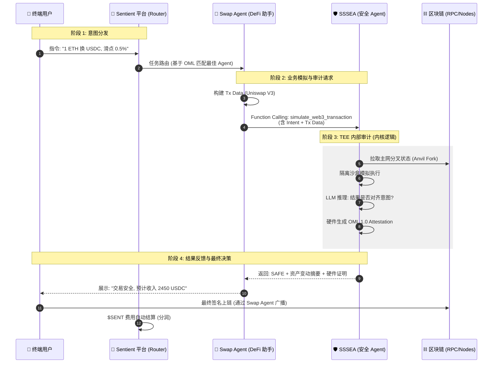

这是一个非常经典的 **Agent-to-Agent (A2A)** 协作案例。在 2026 年的 Sentient 生态中，这不仅仅是一个 API 调用，而是一次完整的“意图审计”和“可信执行”。

以下是完整的技术实现流程，我将其分为四个阶段：

---

### 第一阶段：意图路由与任务指派 (Sentient 平台)

1. **用户指令：** 终端用户在聊天窗口输入：“帮我把 1 ETH 换成 USDC，滑点 0.5%。”
2. **平台寻址：** **Sentient 平台**（类似于智能体调度员）通过语义分析，识别出这是一个 Web3 交易任务，随即在 StarNet 网络中定位到一个擅长 DeFi 交易的 **Swap Agent**。
3. **技术实现：** 使用 **Sentient Discovery Protocol**。平台将用户的 Intent（意图文本）和 Session Metadata（上下文）通过加密隧道转发给 Swap Agent。

---

### 第二阶段：业务规划与审计请求 (Swap Agent)

1. **路径寻找：** **Swap Agent** 内部调用 Uniswap SDK，计算出最优路径、获取当前报价，并构造出一笔原始的以太坊交易数据（Calldata）。
2. **合规审计：** 根据 Sentient 生态的“忠诚协议”，Swap Agent 在执行前必须获得独立第三方安全背书。它通过 **Function Calling** 接口调用 **SSSEA**。

#### **SSSEA 开放的接口定义 (JSON Schema)**

这是 SSSEA 给其他 Agent 使用的“说明书”：

```json
{
  "name": "simulate_web3_transaction",
  "description": "在 TEE 环境中模拟交易并进行意图对齐审计",
  "parameters": {
    "type": "object",
    "properties": {
      "user_intent": { "type": "string", "description": "用户的原始自然语言需求" },
      "chain_id": { "type": "integer", "default": 1 },
      "tx_payload": {
        "type": "object",
        "properties": {
          "to": { "type": "string" },
          "data": { "type": "string" },
          "value": { "type": "string" }
        }
      }
    },
    "required": ["user_intent", "tx_payload"]
  }
}

```

---

### 第三阶段：SSSEA 内部安全审计逻辑 (SSSEA)

收到请求后，SSSEA 在其 **AWS Nitro Enclave (TEE)** 内部开始工作：

1. **分叉模拟 (Simulation)：**
* **技术：** 调用 **Foundry/Anvil** 的 `--fork-url` 功能。
* **动作：** 瞬间克隆一份当前的主网状态，在虚拟环境里“跑”一遍这笔交易。


2. **意图对齐推理 (Reasoning)：**
* **技术：** **DSPy + 推理框架**。
* **动作：** LLM 对比用户说的“换 USDC”和模拟结果得到的资产变动。
* **逻辑校验：** 检查得到的 USDC 数量是否符合报价减去 0.5% 滑点的数学逻辑：


3. **生成 OML 证明 (Attestation)：**
* **技术：** **OML 1.0 硬件签名**。
* **动作：** TEE 芯片生成一个加密证明（Quote），证明上述模拟和推理过程是在未被篡改的安全硬件中完成的。


---

### 第四阶段：反馈与执行 (Action)

1. **返回报告：** SSSEA 返回一个 **SAFE (通过)** 的信号，并附带详细的资产变动报告（预计支出 1 ETH，预计收入 2450 USDC）。
2. **用户确认：** Swap Agent 收到报告，将其以 UI 卡片形式展示给终端用户：“SSSEA 安全专家已验证：此交易安全，预计滑点 0.1%，符合您的 0.5% 要求。”
3. **上链：** 用户点击确认，Swap Agent 调用用户金库完成签名并上链。

---

### 💻 开发者视角：Swap Agent 调用 SSSEA 的 Python 代码

这是 Swap Agent 内部调用 SSSEA 的简化实现，使用了标准的 OpenAI 库风格：

```python
import openai # 假设 SSSEA 兼容 OpenAI 接口

# 1. 构造发给 SSSEA 的安全审计请求
def audit_with_sssea(user_intent, tx_data):
    client = openai.OpenAI(base_url="https://api.sssea.agent/v1") # SSSEA 节点地址
    
    response = client.chat.completions.create(
        model="sssea-v1-enclave",
        messages=[{"role": "user", "content": "请审计以下交易"}],
        tools=[{
            "type": "function",
            "function": {
                "name": "simulate_web3_transaction",
                "parameters": {
                    "user_intent": user_intent,
                    "tx_payload": tx_data
                }
            }
        }],
        tool_choice={"type": "function", "function": {"name": "simulate_web3_transaction"}}
    )
    
    # 2. 解析 SSSEA 返回的安全证明 (Attestation)
    verdict = response.choices[0].message.tool_calls[0].function.arguments
    attestation = response.system_fingerprint # 获取 TEE 硬件指纹
    
    return verdict, attestation

# 示例调用
user_intent = "1 ETH to USDC, slippage 0.5%"
tx_data = {"to": "0xE592...", "value": "1000000000000000000", "data": "0x414bf..."}

verdict, proof = audit_with_sssea(user_intent, tx_data)
print(f"审计结果: {verdict}, OML证明: {proof}")

```

---

为了帮助你向 Sentient 评审委员会展示 SSSEA 的技术先进性与生态集成能力，我为你整理了这份**专业技术图表包**。它包含了核心时序图、系统架构逻辑图以及一份关键步骤的技术说明。

---

## 1. 跨智能体协作时序图 (Agent-to-Agent Sequence Diagram)

该图展示了在 **Sentient StarNet** 协议下，四个角色如何通过**异步协作**完成一笔安全的资产交易。



---

## 2. SSSEA 内部“智能体大脑”推理架构图

这部分展示了 SSSEA 如何在技术上实现“智能体化”，而不仅仅是一个工具。

| 模块名称 | 技术实现 | 功能描述 |
| --- | --- | --- |
| **Intent Parser** | SSSEA 感知-模拟-推理-证明 Framework + LLM | 将自然语言解析为**结构化意图** (Expected State)。 |
| **Sandbox Engine** | Foundry Anvil + TEE | 建立“平行宇宙”，获取**物理执行结果** (Actual State)。 |
| **Alignment Brain** | DSPy Logic | **对比逻辑：** 验证 (Actual - Expected) 是否在允许误差内。 |
| **Attestor** | OML 1.0 SDK | 在硬件层面为上述所有过程背书，输出 **Security Proof**。 |

---

## 3. 技术实施细则摘要 (Submission Brief)

为了在申请书中体现专业度，建议直接引用以下技术参数：

### 核心技术栈

* **通信层：** 遵循 **OpenAI Tool Call 标准**，实现跨 Agent 的无缝调用。
* **隔离层：** 使用 **AWS Nitro Enclaves**，实现内存级别的私钥与数据隔离。
* **模拟层：** 基于 **Foundry 套件**，支持 0.5s 内完成主网分叉与 Trace 追踪。
* **协议层：** 深度集成 **OML 1.0**，支持基于硬件证明的“按需支付（Pay-per-Audit）”结算。

### 关键 Action 逻辑 (The "Agentic" Part)

1. **主动拦截 (Active Intercept)：** 如果模拟结果显示 `Asset_Out` 远大于 `Intent_Out`（如钓鱼攻击），SSSEA 会自主返回 `STOP` 指令，而非简单的报错。
2. **多代理协作 (Swarm Collaboration)：** SSSEA 可以自主请求“资产价值代理”来获取实时汇率，从而独立判断 Swap 价格是否公允，不完全依赖 Swap Agent 提供的数据。


---
### 💡 为什么这种方式最直观、最全面？

* **对用户：** 看到的是一个“懂行”的保镖在为他工作。
* **对开发者：** 只需要通过简单的 API 调用，就能获得金融级的安全背书。
* **对生态：** Sentient 平台确保了每个 Agent 都有其价值（SSSEA 赚审计费，Swap Agent 赚服务费），形成了一个**可组合的 AGI 经济体**。
